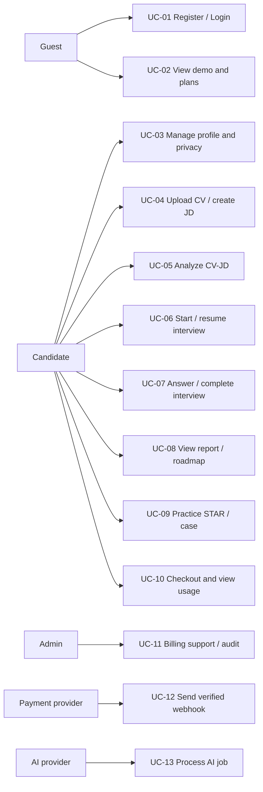
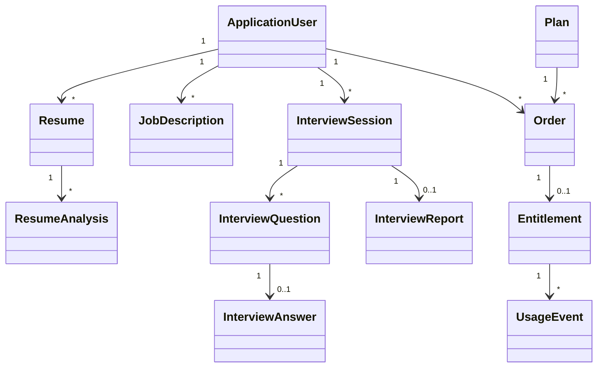
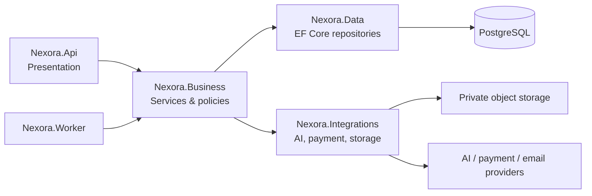
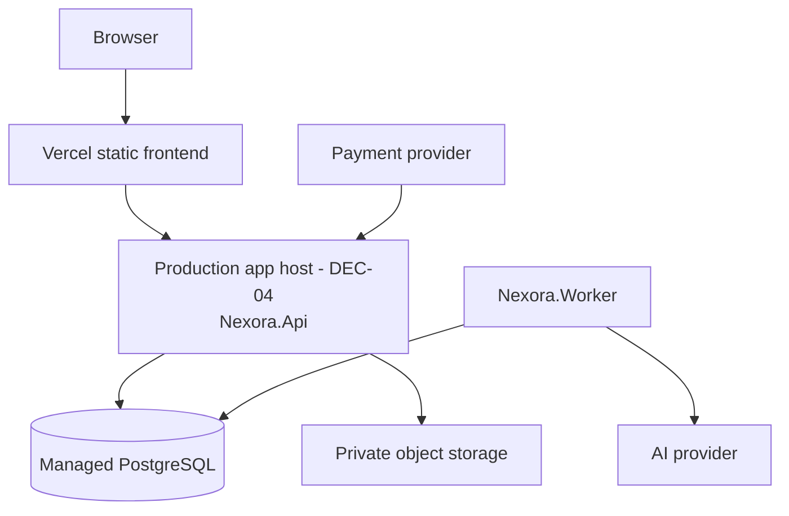

# Analysis and Design Models — Nexora

**Status:** Approved planned-design baseline  
**Last updated:** 2026-08-21  
Các diagram/spec dưới đây mô tả mục tiêu implementation .NET 10, không phải bằng chứng rằng backend đã tồn tại.

## 1. System scope

Nexora là web ứng dụng luyện phỏng vấn: candidate cá nhân hoá practice bằng CV/JD, mock interview, STAR/case và report. Guest được xem demo; mọi hành động tạo/lưu/AI/payment cần login. Live interview copilot, marketplace và native mobile nằm ngoài MVP.

## 2. Capacity profile

| Dimension | Baseline staging dataset |
| --- | --- |
| Registered candidates | 1.000 |
| CV/JD documents | 500 |
| Interview sessions / answers / reports | 2.000 / 10.000 / 1.000 |
| Concurrent active users | 100 |
| CRUD test load | 50 VUs, 15 RPS trong 10 phút |
| Burst | 100 VUs, 30 RPS trong 60 giây |

AI provider được fake/sandbox trong test load. Không benchmark endpoint bằng cách làm request phải chờ inference của model.

## 3. Use-case model



## 4. Use-case summary

| UC | Actor | Precondition | Successful postcondition |
| --- | --- | --- | --- |
| UC-01 | Guest | None | Authenticated session/profile exists. |
| UC-02 | Guest | None | Demo/plan shown; no personal data created. |
| UC-03 | Candidate | Authenticated | Profile/consent updated or deletion request tracked. |
| UC-04 | Candidate | Authenticated | Private resume/JD record and job state exist. |
| UC-05 | Candidate | Resume/JD valid + entitlement | Async analysis is queued/completed. |
| UC-06 | Candidate | Context valid + quota | One session becomes `active` with one persisted first question and consumed reservation. |
| UC-07 | Candidate | Own active session | Answer persists; session/report progresses exactly once. |
| UC-08 | Candidate | Own completed session | Report/roadmap shown; no state change. |
| UC-09 | Candidate | Authenticated + feature entitlement | STAR/case result/draft persists. |
| UC-10 | Candidate | Authenticated | Pending order created or usage visible. |
| UC-11 | Admin | Admin policy | Support action and audit record exist. |
| UC-12 | Payment provider | Valid signature | One payment event/order transition is persisted. |
| UC-13 | Worker/AI provider | Valid queued job | Validated output or terminal failed job exists. |

## 5. Detailed use-case specifications

### UC-04 — Upload CV / create JD

**Actors:** Candidate; storage provider; worker.  
**Preconditions:** candidate authenticated; file under configured size and supported format.  
**Main sequence:**

1. Candidate requests upload intent.
2. API validates auth/rate limit and returns short-lived signed PUT URL.
3. Browser uploads to private storage then submits file metadata/checksum.
4. `ResumeService` persists `stored_file` + `resume` with state `uploaded` and writes extraction outbox event.
5. Worker validates/extracts text and changes resume to `ready`, or to `failed` with safe error code.

**Alternative sequences:** invalid MIME/size → 400 without record; expired signed URL → request new intent; extraction failure → resume remains accessible for retry/delete but cannot start analysis.  
**Postconditions:** no public URL is stored; only owner can request download/analysis.

### UC-06 — Start mock interview

**Actors:** Candidate; quota service; AI worker/provider.  
**Preconditions:** authenticated candidate owns referenced CV/JD; plan has entitlement; context passes validation.  
**Main sequence:**

1. Candidate submits role, level, type, difficulty and optional CV/JD IDs with idempotency key.
2. Initial API transaction validates auth, ownership, entitlement and idempotency key; it reserves quota, persists session `starting` and creates the outbox job.
3. API commits and returns session `starting`; client polls/reloads the session.
4. Worker generates the first usable question and server validates structured output.
5. Worker success transaction persists the question, converts reservation to `consume` and transitions `starting → active`, then commits.

**Alternative sequences:** quota exhausted → 403 and no job; duplicate key → original session returned; terminal worker failure before activation → one transaction converts reservation to `void` and transitions `starting → failed`.  
**Postconditions:** exactly one session exists for the idempotent request. Success has one persisted first question, one consume effect and `active`; terminal pre-activation failure has one void effect and `failed`. State and ledger are auditable.

### UC-07 — Answer and complete interview

**Actors:** Candidate; AI worker/provider.  
**Preconditions:** candidate owns session; session is `active`; question belongs to that session.  
**Main sequence:**

1. Candidate submits one answer with idempotency key.
2. Service locks session version, persists official answer and queues evaluation.
3. Worker validates rubric output, persists evaluation and either next question or completion job.
4. On last question, service transitions session to `completing`; the idempotent report job creates one immutable report, then transitions once to `completed`.

**Alternative sequences:** stale session/version → 409 with current state; duplicate answer → return original result; report job failure → retry free as BR-08.  
**Postconditions:** question order, answer and evidence are reproducible; report is never generated twice.

### UC-10 / UC-12 — Checkout and webhook

**Actors:** Candidate; payment provider; Admin (exception handling).  
**Preconditions:** candidate authenticated; selected plan active and price server-known.  
**Main sequence:**

1. Candidate creates checkout session; server writes pending order with price snapshot/idempotency key.
2. Candidate completes hosted provider flow.
3. Provider sends signed event to webhook.
4. Webhook verifies signature/timestamp and unique provider event ID.
5. Billing service marks order paid, creates entitlement and audit/outbox records in one transaction.

**Alternative sequences:** invalid/replayed event → no state change; payment failed/expired → order terminal; refund → BR-07.  
**Postconditions:** order/payment/entitlement history is immutable and reconcilable.

### UC-11 — Admin billing support

**Actors:** Admin.  
**Preconditions:** explicit `Admin` policy, ticket/reason code.  
**Main sequence:** admin queries redacted order metadata, submits refund or entitlement adjustment with idempotency key, backend calls provider if relevant, then writes audit log.  
**Alternative:** non-admin → 403; provider failure → no local entitlement change until reconciled.  
**Postcondition:** audit contains actor/action/reason/resource/outcome; CV/transcript remains unavailable by default.

## 6. Sequence diagrams

### SD-01 — Interview start with quota reservation

```mermaid
sequenceDiagram
  participant B as Browser
  participant API as API/InterviewService
  participant DB as PostgreSQL
  participant W as Worker
  participant AI as AI Provider
  B->>API: POST /interviews (idempotency key)
  API->>API: validate auth, CV/JD ownership, entitlement, key
  API->>DB: BEGIN; lock entitlement FOR UPDATE
  API->>DB: reserve quota + session starting + outbox/job
  API->>DB: COMMIT
  API-->>B: 201 session starting
  W->>DB: dequeue outbox/job
  W->>AI: generate structured first question
  AI-->>W: question JSON
  W->>W: validate first usable question
  alt valid first question
    W->>DB: BEGIN
    W->>DB: persist question + reserve to consume + starting to active
    W->>DB: COMMIT
  else terminal failure before activation
    W->>DB: BEGIN
    W->>DB: reserve to void + starting to failed
    W->>DB: COMMIT
  end
  B->>API: GET /interviews/{id}
  API-->>B: active + first question, or failed
```

All API/worker retries are idempotent: they cannot duplicate the session, first question, usage event or job effect.

### SD-02 — Payment webhook

```mermaid
sequenceDiagram
  participant P as Payment Provider
  participant API as Billing Webhook
  participant DB as PostgreSQL
  P->>API: signed payment event
  API->>API: verify signature + timestamp
  API->>DB: BEGIN; check unique provider event
  API->>DB: payment event + paid order + entitlement + audit
  API->>DB: COMMIT
  API-->>P: 2xx acknowledgement
```

## 7. Conceptual class diagram



Physical columns, constraints, lifecycle and storage boundary are canonical in [08-data-model.md](08-data-model.md), not in this conceptual diagram.

## 8. Package and deployment diagrams





## 9. Pattern plan — not claimed source evidence

| Pattern | Planned boundary | Why |
| --- | --- | --- |
| Strategy | `ITextExtractor` by PDF/DOCX and optional scoring/rubric strategy | Add formats/rubrics without changing orchestration. |
| Adapter | `IAiProvider`, `IPaymentProvider`, `IStorageProvider`, `IEmailSender` | Isolate vendor SDKs and test with fakes. |
| Facade | `ResumeService` / `InterviewService` orchestration | Controllers do not coordinate storage, DB, AI and jobs. |
| Outbox | Billing/quota/session state change → job/notification | Avoid DB commit without downstream event. |
| State machine | Session/order/job states | Prevent invalid and duplicate transitions. |

When backend exists, add implementation evidence: source path, concrete participant, test, and an appendix that records any mismatch between specification and source.

## 10. Traceability matrix

| Requirement | Use case | Primary API/service | Test evidence |
| --- | --- | --- | --- |
| FR-AUTH-01..04 | UC-01/03 | Auth/Profile service | T-01, T-02, T-09 |
| FR-BILL-01..07 | UC-10/12 | BillingService | T-03, T-04, T-05 |
| FR-CV-01..04 | UC-04/05 | ResumeService/worker | T-06, T-07 |
| FR-INT-01..04 | UC-06/07/08 | InterviewService/worker | T-03, T-07, T-08 |
| FR-PRAC-01..02 | UC-09 | StarService/ScenarioService | owner isolation test |
| FR-ADM-01 | UC-11 | Admin policy/Billing support | admin 403/audit test |
| NFR-PERF-01 | All APIs | API + worker topology | k6 baseline results |
| NFR-PRIV-01 | UC-03/04 | deletion/storage lifecycle | T-09, retention review |
